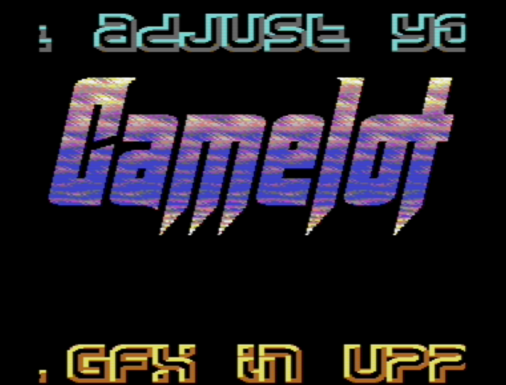
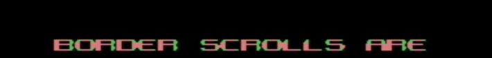

# Multicolor Ghostbyte Shine-through: How to Make an Unexpanded C64 Border Scroll

trident / fairlight

January 2023

The Commodore 64 intro [Orbit Untold](https://csdb.dk/release/?id=228365) by Fairlight from 2023 ([youtube link](https://youtu.be/tiMKM1toYTs)) features a border scroll that looks unexpanded, despite
being placed in the lower border and despite covering the entire visible screen
area. This document explains how this effect is achieved with a technique we call multicolor ghostbyte shine-through.

## Background

On the Commodore 64, there are a few ways to produce graphics in the border
area. Two the most commonly used are sprites and ghostbytes.

Sprites are very flexible in terms of what type of graphics we can produce,
including multicolor graphics. But they are limited to 8 sprites per line and their
width is limited to either 24 pixels or 48 expanded pixels per sprite. With
unexpanded sprites, we can get 8 * 24 = 192 pixels wide graphics. This
will cover less than 2/3 of the visible screen area. With expanded
sprites, we can fill the entire visible area, but our pixels will twice as
wide due to the need for expanded sprites.

The ghostbyte is extremely restricted. It provides 8 bits of black pixels that
are repeated every 8 pixels on in the visible screen area when the border is
opened. Also, ghostbytes can only be used in the upper and lower borders and
cannot be used in the side borders.

The three pictures below illustrate how sprites and ghostbytes work. The
leftmost picture shows how the C64 screen looks by default, with all borders
intact. The middle picture shows all 8 sprites in the lower border, with both
the lower and upper borders removed. The sprites are placed adjacent to each
other and expanded in the X direction so that they cover the entire width of
the border area. The third picture shows the effect of the ghostbyte. In this
case, the ghostbyte is set to `$01`, resulting in one-pixel wide bands across
the upper and lower borders.

C64 screen with borders | Sprites in lower border  |   Ghostbyte $01 in upper and lower border
:-------------------------:|:-------------------------:|:-------------------------:
 | | 

If we combine sprites and ghostbytes, we can produce what looks like
unexpanded graphics in the lower and upper borders.

### A First Approach: Ghostbyte Masking

The simplest way to produce what appears to be an unexpanded scroll in the
upper or lower border is to use ghostbyte masking. This involves setting the
sprite priority lower than the ghostbyte priority and use the ghostbyte to
mask out some of the pixels of the expanded sprites.

This makes it possible to produce single-pixel width graphics, as long as the
pixels are positioned under the ghostbyte mask.

The pictures below shows how ghostbyte masking works to make an expanded
letter `A` appear to be non-expanded. The `A` consists of 4 expanded single
color pixels, that result in an 8 pixel wide `A`.

This `A` is visibly expanded.

By setting the sprite priority so that the sprite is behind the ghostbyte and by
setting the ghostbyte to the pixel pattern `$81`, we end up with the `A`
below.

This `A` now looks like it is unexpanded.

This technique has often been used to make border scrolls look like they are
unexpanded. Two examples are Rash's part in [My, Oh My](https://csdb.dk/release/?id=3218) by Light from 1991 ([youtube link](https://youtu.be/DUDWW_cRXt4?t=844)) and Graham's border
scroll in the 1998 Crest and Oxyron production [Coma Job](https://csdb.dk/release/?id=11653) ([youtube link](https://youtu.be/MPc8_xg_NZg?t=97)).

My, Oh My (1991)          |  Coma Job (1998)
:-------------------------:|:-------------------------:
 | 

The My Oh My scroller shows some of the limitations of this technique: pixels
that are in the middle of a letter cannot easily be masked, leading to
an awkward looking `M` character. Graham's scroller overcomes this by using a
more appropriate font, as well as a changing background color that makes the
problems less visible.

The color of the ghostbyte mask is restricted to the color black, because the
ghostbyte is always black.

The ghostbyte masking trick is very commonly used in demos from the 1990s era.

In [Crest Avantgarde](https://csdb.dk/release/?id=2554) from 1992, Crossbow and Vision of Crest took the ghostbyte masking trick one step further to create what appears to be a fully unexpanded upscroll ([youtube link](https://youtu.be/Ze45K_f5YWo?t=342)). In this case, they change the ghostbyte throughout the screen and use an additional black sprite to cover the side border area. This is evident if we change the background color from black to red.

Crest Avantgarde (1992)  |    The trick revealed
:-------------------------:|:-------------------------:
 | 

### Multicolor Ghostbyte Shine-through

Multicolor ghostbyte shine-through - the trick used in Orbit Untold - is similar
to ghostbyte masking, but with a few key differences. Instead of using the
ghostbyte to mask the sprite pixels, we create holes in the pixel data and
let the ghostbyte and background shine through. By crafting specific patterns
with the ghostbyte, we can achieve complex graphics that appear to be
unexpanded even if the sprites are expanded.

There are a couple of more differences between multicolor ghostbyte shine-through and
ghostbyte masking:
* the ghostbyte is underneath the sprites, not on top of them
* the ghostbyte is typically changed every raster line
* we use multicolor to be able to selectively decide where our ghostbytes will shine through

The main drawback of multicolor ghostbyte shine-through over ghostbyte masking
is that since we are using multicolor, each pixel is now 4 pixels wide.

This trick was probably first found by Crossbow and used in the 1992 Crest
demo [Crest Avantgarde](https://csdb.dk/release/?id=2554) ([youtube link](https://youtu.be/Ze45K_f5YWo?t=1153)). HCL then used it
in [Totally Stoned 2](https://csdb.dk/release/?id=7580) by Booze Design from
1993 ([youtube link](https://youtu.be/s7DEU-7u7gw?t=1383)). Cruzer / Camelot made excellent use of the trick
in his [GULBData](https://csdb.dk/release/?id=171924) intro from 2018.

Crest Avantgarde (1992)  |    Totally Stoned 2 (1993) | GULBData (2018)
:-------------------------:|:-------------------------:|:-----:
 |  | 

There are probably several other examples of this trick being used in demos,
but it does not seem to be very widely used. Possibly because it is so hard
to figure out how it is supposed to be done. Myself, I was not
able to figure out how this was done when I saw Crest Avantgarde and Totally
Stoned 2 back in 1992-1993. It wasn't until seeing Cruzer's GULBData intro it
finally clicked for me.

### Making it Work: a Case Study

We arrange the ghostbytes, which we change each rasterline, into the pattern
below. The black pixels are the ghostbyte pixels, and the gray pixels are the
background ($d021) color.

We can then draw an upper case `A` in a way where those ghostbyte pixels will shine
through on specific locations. To make the ghostbyte pattern shine through,
we use multicolor `00` for those pixels. We set one of the other multicolors to the same color
as the background color, and set a third multicolor to black. The black color is
used to make it blend together with the black ghostbyte pixels.

In the picture below, the blue pixels correspond to the `00` multicolor, the
one that will let the underlying ghostbyte and background color shine
through.

If we apply the ghostbyte mask underneath the letter, it will shine through only on
the blue areas of the `A`. If we use white color for the background color, we end up with
a reasonably looking `A`:

We can now draw an entire font to take advantage of this technique:

Those are the first characters of the font from the intro, as they were drawn
in gimp. This is the result as they are displayed with the ghostbyte
shine-through and with background raster colors that change on every raster line:

If we put all this together, we can create an unexpanded border scroll by
drawing selected characters on 7 expanded sprites and moving them
horizontally:

To reveal what parts of each character use sprite multicolor and what parts
use the background and ghostbyte shine-through, we can use two different
colors. The picture below shows the sprite multicolor in red and the
background colors in green. We can now see what parts of each character are
sprite multicolor and where the background color and ghostbyte shine
through.

## Conclusions

Multicolor ghostbyte shine-through is a really neat way to produce what
appears to be unexpanded graphics in the lower and upper borders. The trick
has been used a few times over the years, but does not appear to be very
widely adopted, possibly because of how difficult it is to figure out how it
works. The trick uses the fact that the background color of a multicolor
sprite lets the background + ghostbyte to shine through, allowing us to
selectively use ghostbyte shine-through, even within individual characters.

## Acknowledgments

Many thanks to Cruzer and HCL for reading and commenting on early drafts of
this paper. Also thanks to HCL for revealing how ghostbyte masking was used
for the upscroll in Crest Avantgarde

Orbit Untold credits:
* Code + scroll font: trident
* Music: Danko
* Logo + font: tNG